# beautyapp

A new Flutter project.

# Features
Cross-platform support: Runs on both Android and iOS.
Simple and user-friendly interface.
Learning milestone: Demonstrates key Flutter concepts like widgets, state management, and navigation.

# Built With
Flutter - Cross-platform app development framework.
Dart - Programming language used with Flutter.

# Learning Highlights
Creating Beauty App helped me:
  Understand the fundamentals of Flutter widgets.
  Explore Dart programming basics.
  Design a simple yet visually appealing user interface.

# Screenshots
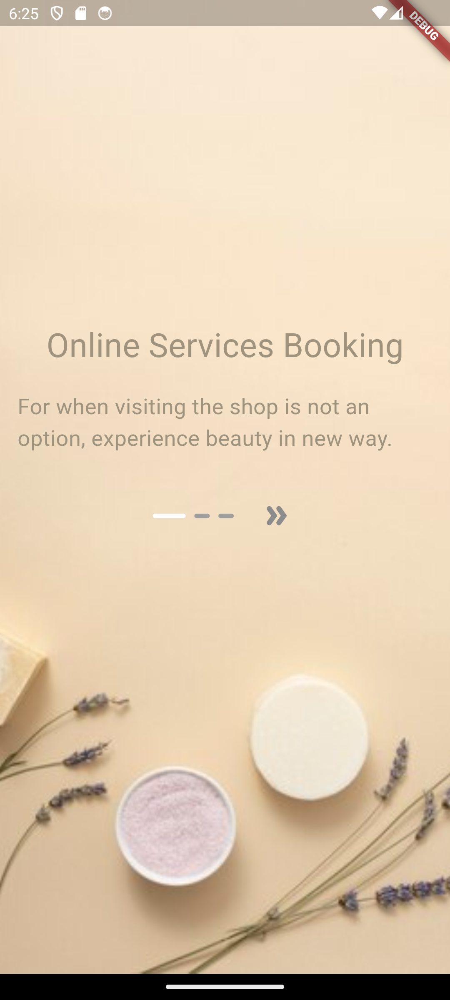
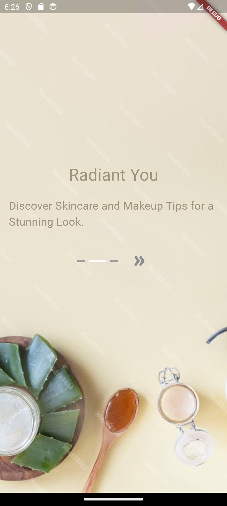
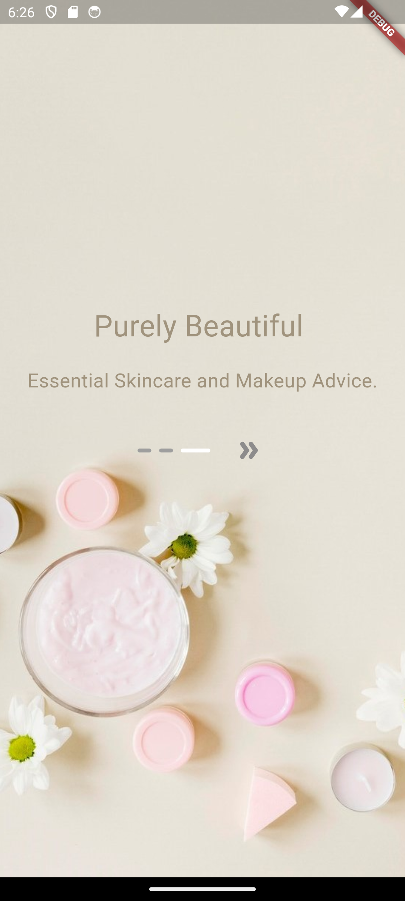
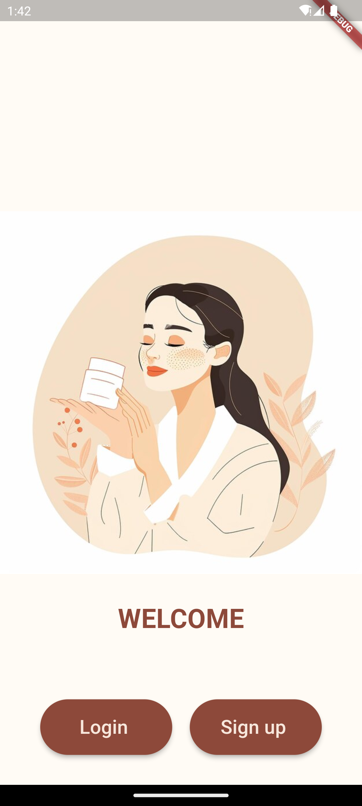
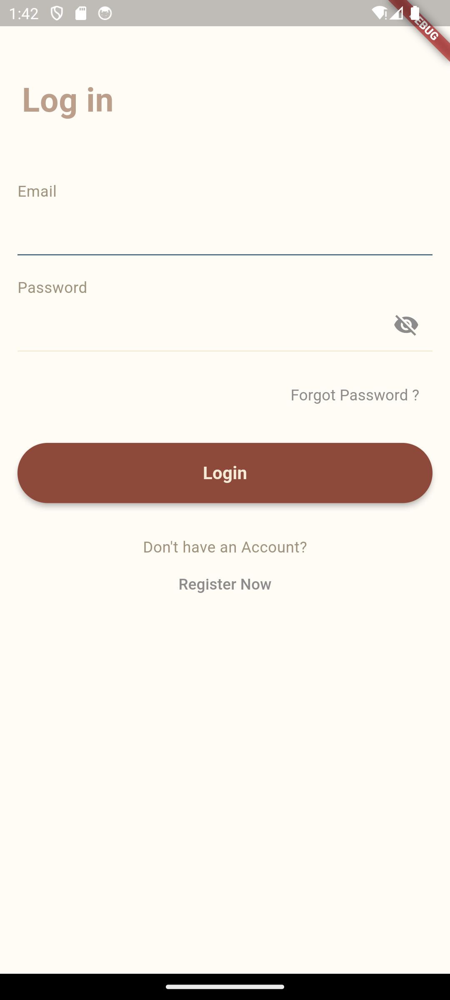
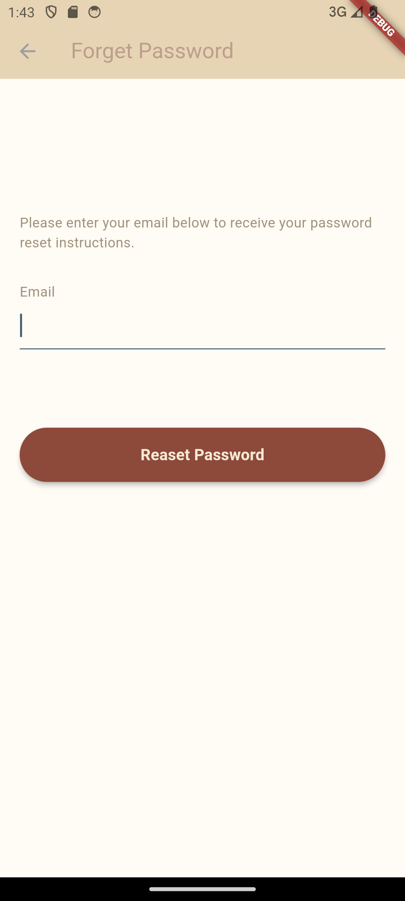
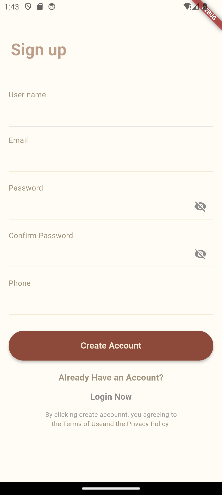
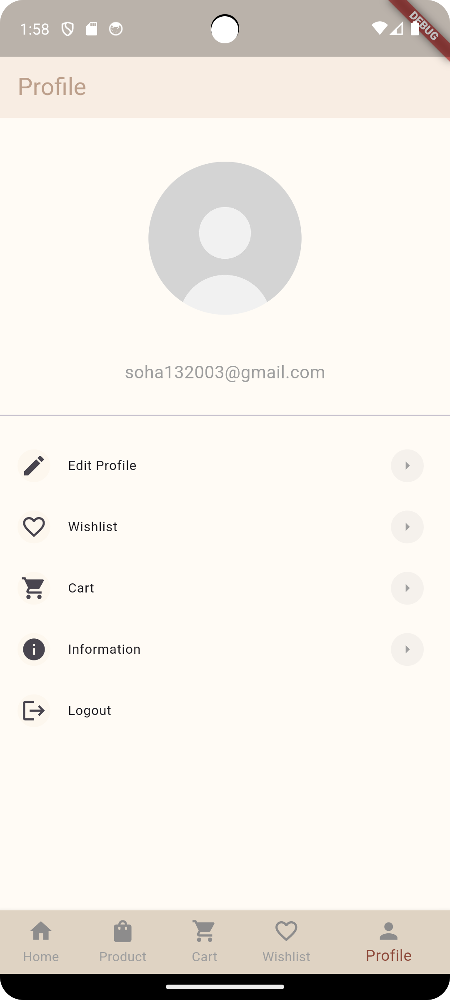
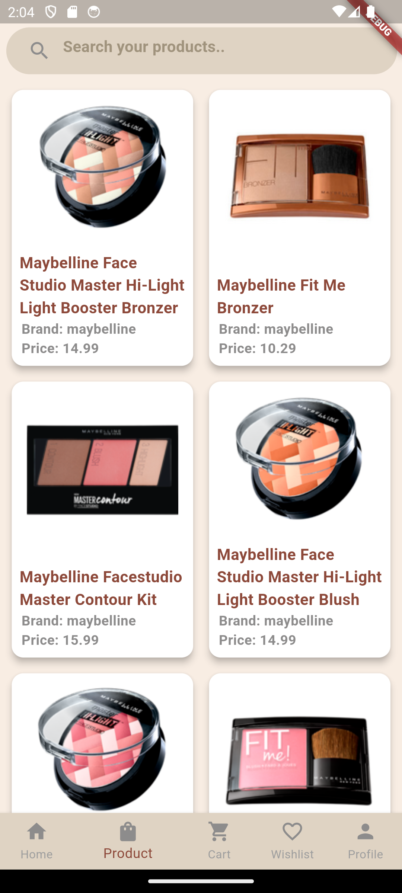
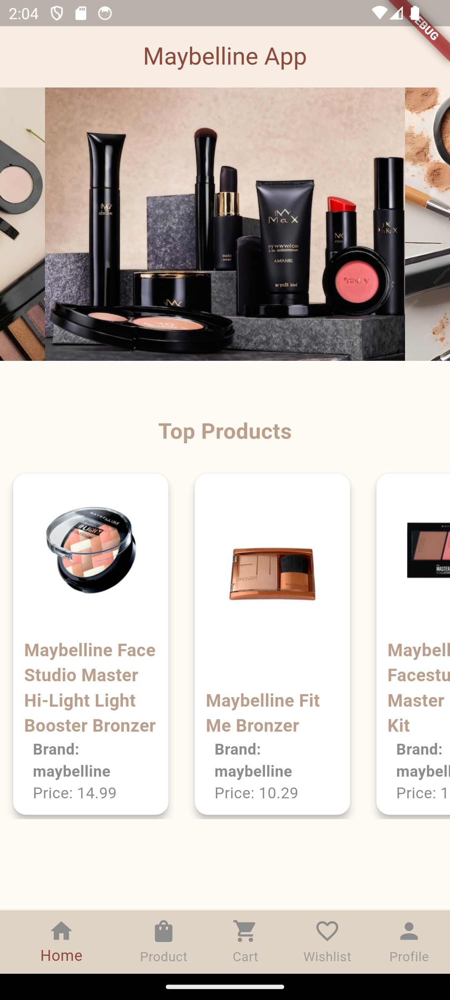
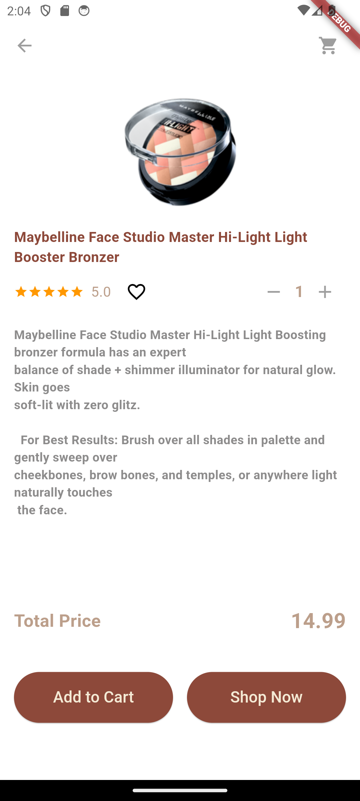
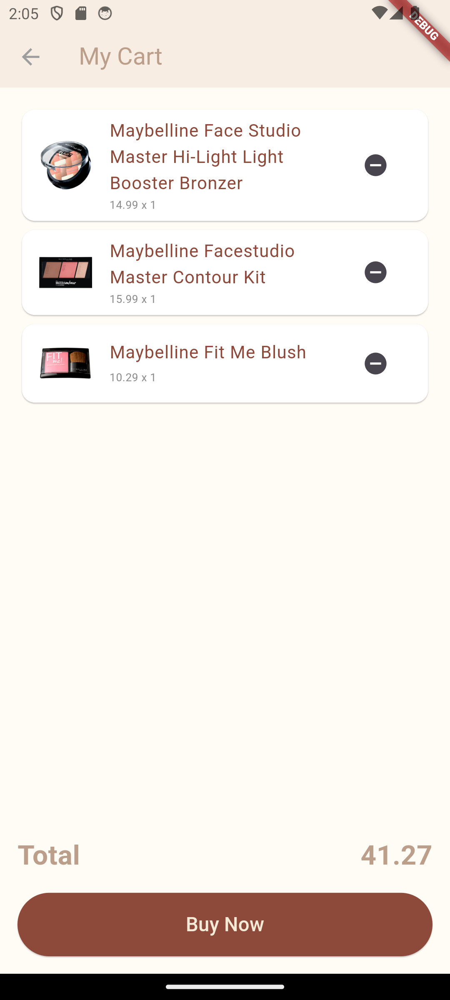
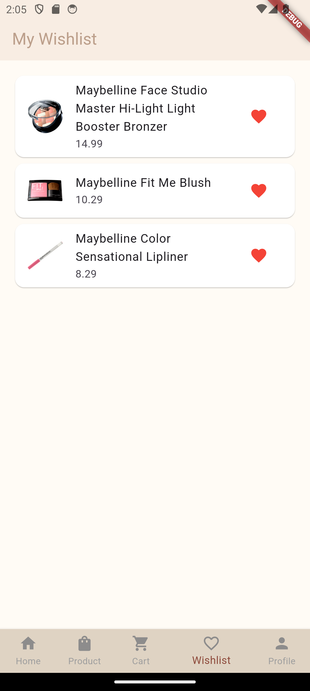
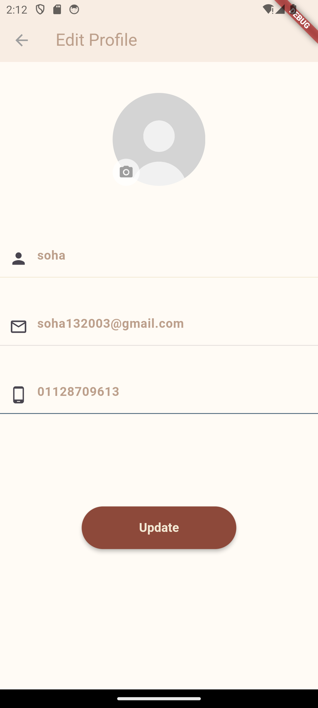
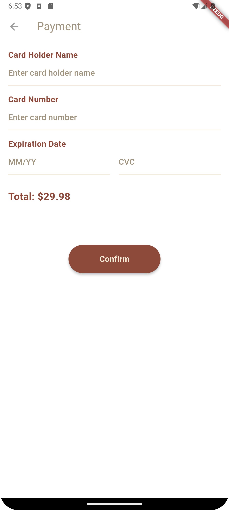
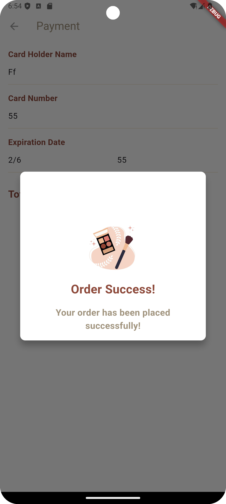

